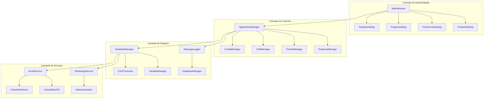
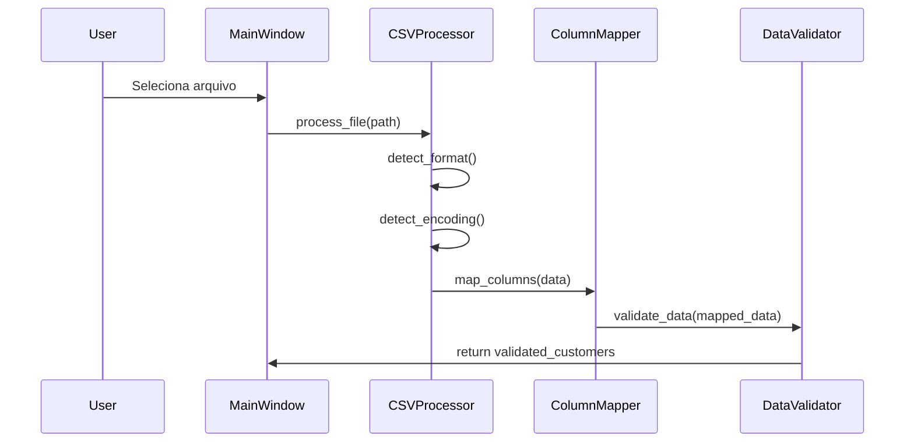
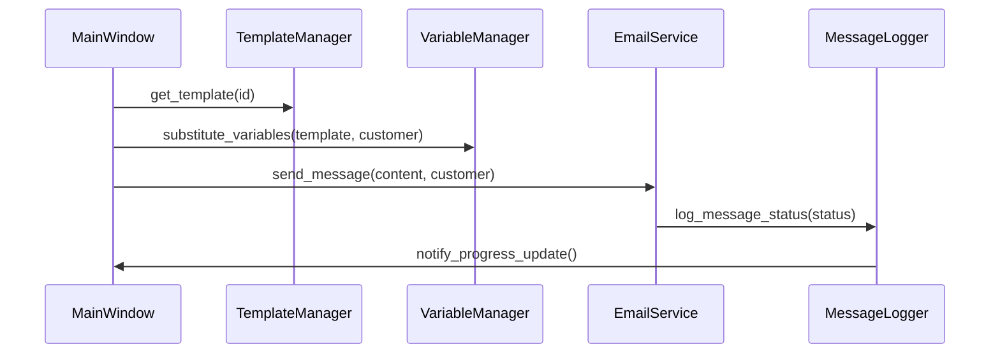

# CSC-Reach - Arquitetura

## Visão Geral da Arquitetura

CSC-Reach segue uma arquitetura MVC (Model-View-Controller) com separação clara de responsabilidades, projetada para máxima flexibilidade, manutenibilidade e extensibilidade multiplataforma.

## Princípios Arquiteturais

### 1. Separação de Responsabilidades
- **Core**: Lógica de negócio e modelos de dados
- **GUI**: Interface do usuário e componentes visuais
- **Services**: Integrações externas (Outlook, WhatsApp)
- **Utils**: Utilitários e funções auxiliares

### 2. Inversão de Dependências
- Componentes dependem de abstrações, não de implementações concretas
- Facilita testes unitários e substituição de componentes
- Permite diferentes implementações por plataforma

### 3. Padrão Observer
- Sistema de eventos para comunicação entre componentes
- Atualizações de progresso em tempo real
- Desacoplamento entre UI e lógica de negócio

## Estrutura de Componentes



## Componentes Principais

### 1. Application Manager
**Localização**: `src/multichannel_messaging/core/application_manager.py`
**Responsabilidades**:
- Inicialização da aplicação
- Gerenciamento do ciclo de vida
- Coordenação entre componentes
- Monitoramento de saúde do sistema

### 2. Configuration Manager
**Localização**: `src/multichannel_messaging/core/config_manager.py`
**Responsabilidades**:
- Gerenciamento de configurações YAML/JSON
- Persistência de preferências do usuário
- Configurações específicas por plataforma
- Validação de configurações

### 3. Template Manager
**Localização**: `src/multichannel_messaging/core/template_manager.py`
**Responsabilidades**:
- CRUD de templates de mensagens
- Categorização e organização (Welcome, Follow-up, Promotional, Support, General)
- Substituição de variáveis dinâmicas
- Import/export de templates
- Analytics de uso e popularidade
- Sistema de backup automático
- Validação e renderização de templates

### 4. CSV Processor
**Localização**: `src/multichannel_messaging/core/csv_processor.py`
**Responsabilidades**:
- Processamento de múltiplos formatos (CSV, Excel, JSON, JSONL, TSV)
- Detecção automática de formato e encoding
- Mapeamento inteligente de colunas
- Validação de dados com relatórios detalhados
- Processamento streaming para arquivos grandes
- Suporte a diferentes delimitadores e encodings

### 5. Message Services
**Localização**: `src/multichannel_messaging/services/`
**Componentes**:
- **EmailService**: Abstração para envio de emails
- **OutlookWindows**: Implementação COM para Windows
- **OutlookMacOS**: Implementação AppleScript para macOS
- **WhatsAppService**: Automação do WhatsApp Web

## Padrões de Design Implementados

### 1. Strategy Pattern
**Uso**: Diferentes implementações de integração por plataforma
```python
# Seleção automática da estratégia baseada na plataforma
if platform.system() == "Windows":
    outlook_service = OutlookWindowsService()
elif platform.system() == "Darwin":
    outlook_service = OutlookMacOSService()
```

### 2. Observer Pattern
**Uso**: Sistema de eventos para atualizações de progresso
```python
class ProgressManager:
    def notify_observers(self, event_type, data):
        for observer in self.observers:
            observer.update(event_type, data)
```

### 3. Factory Pattern
**Uso**: Criação de processadores de arquivo baseado no tipo
```python
class ProcessorFactory:
    @staticmethod
    def create_processor(file_type):
        if file_type == "csv":
            return CSVProcessor()
        elif file_type == "excel":
            return ExcelProcessor()
```

### 4. Singleton Pattern
**Uso**: Gerenciadores globais (Config, I18n, Theme)
```python
class ConfigManager:
    _instance = None
    
    def __new__(cls):
        if cls._instance is None:
            cls._instance = super().__new__(cls)
        return cls._instance
```

## Fluxo de Dados

### 1. Importação de Dados


### 2. Envio de Mensagens


## Integração Multiplataforma

### Windows
- **Outlook Integration**: COM (Component Object Model)
- **Dependencies**: pywin32
- **Permissions**: Nenhuma permissão especial necessária

### macOS
- **Outlook Integration**: AppleScript via ScriptingBridge
- **Dependencies**: pyobjc-framework-ScriptingBridge
- **Permissions**: Automation permissions necessárias

## Gerenciamento de Estado

### 1. Application State
- **ConfigManager**: Configurações persistentes
- **UserPreferences**: Preferências do usuário
- **ThemeManager**: Estado do tema atual

### 2. Session State
- **ProgressManager**: Estado do progresso atual
- **TemplateManager**: Templates carregados
- **CustomerData**: Dados importados da sessão

## Tratamento de Erros

### 1. Hierarquia de Exceções
```python
class CSCReachException(Exception):
    """Exceção base do sistema"""

class ValidationError(CSCReachException):
    """Erro de validação de dados"""

class IntegrationError(CSCReachException):
    """Erro de integração externa"""

class ConfigurationError(CSCReachException):
    """Erro de configuração"""
```

### 2. Estratégias de Recuperação
- **Retry Logic**: Tentativas automáticas para falhas temporárias
- **Graceful Degradation**: Funcionalidade reduzida em caso de falhas
- **User Notification**: Notificações claras sobre erros e soluções

## Logging e Monitoramento

### 1. Sistema de Logging
- **Níveis**: DEBUG, INFO, WARNING, ERROR, CRITICAL
- **Destinos**: Console, arquivo, banco de dados
- **Rotação**: Automática baseada em tamanho e tempo

### 2. Métricas de Performance
- **Tempo de processamento**: Por operação
- **Taxa de sucesso**: Por canal de envio
- **Uso de memória**: Monitoramento contínuo
- **Latência de rede**: Para integrações externas

## Segurança

### 1. Proteção de Dados
- **Validação de entrada**: Sanitização de todos os inputs
- **Criptografia**: Dados sensíveis em repouso
- **Logs seguros**: Exclusão de informações pessoais dos logs

### 2. Integrações Seguras
- **Outlook**: Uso de APIs oficiais
- **WhatsApp**: Automação controlada sem armazenamento de credenciais
- **Arquivos**: Validação de tipos e tamanhos

## Extensibilidade

### 1. Plugin Architecture
- **Interface padrão**: Para novos canais de mensagem
- **Registro dinâmico**: Descoberta automática de plugins
- **Configuração flexível**: Suporte a configurações específicas

### 2. Customização
- **Templates**: Sistema flexível de templates
- **Temas**: Suporte a temas customizados
- **Idiomas**: Sistema de internacionalização extensível
