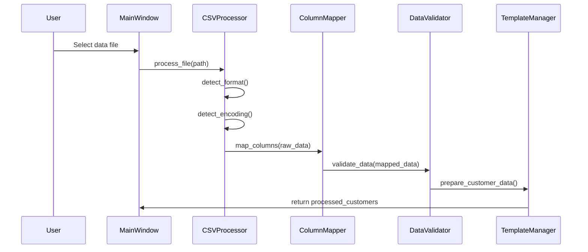
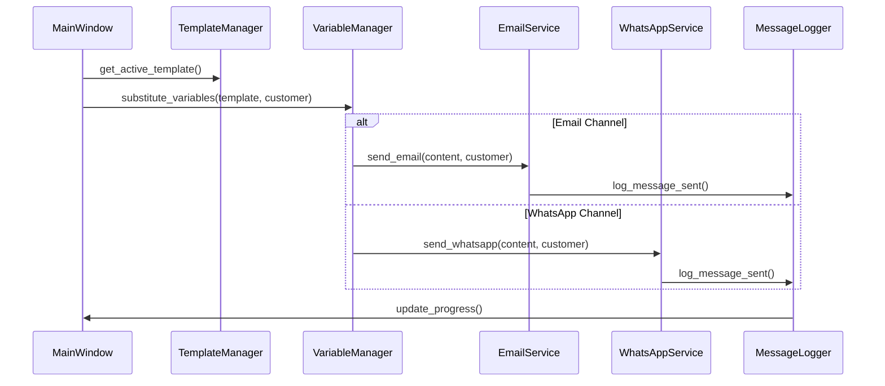
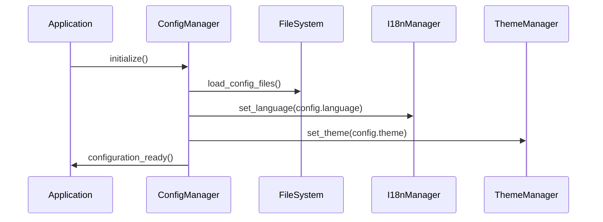

# Backend Architecture

## Overview

CSC-Reach's backend follows a clean MVC (Model-View-Controller) architecture with clear separation of concerns. The backend is built entirely in Python 3.8+ using modern design patterns and cross-platform compatibility in mind.

## Project Structure

```
src/multichannel_messaging/
├── core/                           # Business Logic Layer
│   ├── application_manager.py      # Application lifecycle management
│   ├── config_manager.py          # Configuration management
│   ├── csv_processor.py           # Multi-format data processing
│   ├── template_manager.py        # Template CRUD operations
│   ├── dynamic_variable_manager.py # Variable substitution engine
│   ├── message_logger.py          # Logging and analytics
│   ├── progress_manager.py        # Progress tracking
│   ├── i18n_manager.py            # Internationalization
│   └── theme_manager.py           # UI theme management
├── services/                       # External Integration Layer
│   ├── email_service.py           # Email service abstraction
│   ├── outlook_windows.py         # Windows COM integration
│   ├── outlook_macos.py           # macOS AppleScript integration
│   └── whatsapp_web_service.py    # WhatsApp Web automation
├── utils/                          # Utility Layer
│   ├── logger.py                  # Logging utilities
│   ├── exceptions.py              # Custom exceptions
│   └── platform_utils.py         # Platform-specific utilities
└── gui/                           # Presentation Layer
    ├── main_window.py             # Main application window
    ├── template_library_dialog.py # Template management UI
    └── progress_dialog.py         # Progress tracking UI
```

## Data Flow

### 1. Data Import Flow


### 2. Message Sending Flow


### 3. Configuration Management Flow


## Core Components

### Application Manager
**File**: `src/multichannel_messaging/core/application_manager.py`

The central orchestrator that manages the application lifecycle:

```python
class ApplicationManager:
    def __init__(self):
        self.config_manager = ConfigManager()
        self.i18n_manager = I18nManager()
        self.theme_manager = ThemeManager()
        self.progress_manager = ProgressManager()
        
    def initialize(self) -> bool:
        """Initialize all core components"""
        
    def shutdown(self):
        """Clean shutdown of all components"""
```

**Responsibilities**:
- Initialize and coordinate all core managers
- Handle application startup and shutdown
- Manage component dependencies
- Provide health monitoring

### Configuration Manager
**File**: `src/multichannel_messaging/core/config_manager.py`

Handles all configuration persistence and validation:

```python
class ConfigManager:
    def __init__(self):
        self.config_path = self._get_config_path()
        self.config_data = {}
        
    def load_config(self) -> Dict[str, Any]:
        """Load configuration from YAML/JSON files"""
        
    def save_config(self, config: Dict[str, Any]):
        """Save configuration with validation"""
        
    def get(self, key: str, default=None):
        """Get configuration value with fallback"""
```

**Features**:
- Cross-platform configuration storage
- YAML/JSON format support
- Schema validation with Cerberus
- Automatic migration for config updates

### CSV Processor
**File**: `src/multichannel_messaging/core/csv_processor.py`

Multi-format data processing engine:

```python
class CSVProcessor:
    def __init__(self):
        self.supported_formats = ['csv', 'xlsx', 'xls', 'json', 'jsonl', 'tsv']
        
    def process_file(self, file_path: str) -> List[Customer]:
        """Process any supported file format"""
        
    def detect_format(self, file_path: str) -> str:
        """Auto-detect file format"""
        
    def detect_encoding(self, file_path: str) -> str:
        """Auto-detect file encoding"""
```

**Capabilities**:
- Automatic format detection (CSV, Excel, JSON, JSONL, TSV)
- Intelligent encoding detection using chardet
- Memory-efficient streaming for large files
- Robust error handling and recovery

### Template Manager
**File**: `src/multichannel_messaging/core/template_manager.py`

Professional template management system:

```python
class TemplateManager:
    def __init__(self):
        self.templates = {}
        self.categories = ['Welcome', 'Follow-up', 'Promotional', 'Support', 'General']
        
    def create_template(self, template: MessageTemplate) -> str:
        """Create new template with validation"""
        
    def get_template(self, template_id: str) -> MessageTemplate:
        """Retrieve template by ID"""
        
    def update_template(self, template_id: str, updates: Dict):
        """Update existing template"""
        
    def delete_template(self, template_id: str):
        """Delete template with confirmation"""
```

**Features**:
- CRUD operations for templates
- Category-based organization
- Import/export functionality
- Usage analytics and tracking
- Multi-channel template support

### Message Logger
**File**: `src/multichannel_messaging/core/message_logger.py`

Comprehensive logging and analytics system:

```python
class MessageLogger:
    def __init__(self):
        self.db_path = self._get_database_path()
        self.connection = sqlite3.connect(self.db_path)
        
    def log_message_sent(self, customer: Customer, channel: str, status: str):
        """Log message sending attempt"""
        
    def get_analytics(self, date_range: Tuple[datetime, datetime]) -> Dict:
        """Generate analytics report"""
        
    def export_logs(self, format: str = 'csv') -> str:
        """Export logs in specified format"""
```

**Capabilities**:
- SQLite database for persistent logging
- Real-time analytics and reporting
- Export functionality (CSV, JSON, Excel)
- Performance metrics tracking

### Platform Services

#### Email Service Abstraction
**File**: `src/multichannel_messaging/services/email_service.py`

```python
class EmailService(ABC):
    @abstractmethod
    def send_email(self, subject: str, body: str, recipient: str) -> bool:
        """Send email through platform-specific implementation"""
        
    @abstractmethod
    def create_draft(self, subject: str, body: str, recipient: str) -> bool:
        """Create draft email for review"""
```

#### Windows Outlook Integration
**File**: `src/multichannel_messaging/services/outlook_windows.py`

```python
class OutlookWindowsService(EmailService):
    def __init__(self):
        import win32com.client
        self.outlook = win32com.client.Dispatch("Outlook.Application")
        
    def send_email(self, subject: str, body: str, recipient: str) -> bool:
        """Send email using Windows COM automation"""
```

#### macOS Outlook Integration
**File**: `src/multichannel_messaging/services/outlook_macos.py`

```python
class OutlookMacOSService(EmailService):
    def __init__(self):
        from ScriptingBridge import SBApplication
        self.outlook = SBApplication.applicationWithBundleIdentifier_("com.microsoft.Outlook")
        
    def send_email(self, subject: str, body: str, recipient: str) -> bool:
        """Send email using macOS AppleScript automation"""
```

### Error Handling Strategy

#### Exception Hierarchy
```python
class CSCReachException(Exception):
    """Base exception for all CSC-Reach errors"""
    
class ValidationError(CSCReachException):
    """Data validation errors"""
    
class IntegrationError(CSCReachException):
    """External service integration errors"""
    
class ConfigurationError(CSCReachException):
    """Configuration and setup errors"""
```

#### Recovery Mechanisms
- **Retry Logic**: Automatic retries for transient failures
- **Graceful Degradation**: Reduced functionality when services unavailable
- **User Notification**: Clear error messages with actionable solutions
- **Logging**: Comprehensive error logging for debugging

### Performance Optimizations

#### Memory Management
- **Streaming Processing**: Large files processed in chunks
- **Lazy Loading**: Components loaded on-demand
- **Resource Cleanup**: Automatic cleanup of temporary resources
- **Connection Pooling**: Reuse of database connections

#### Caching Strategy
- **Template Caching**: Frequently used templates cached in memory
- **Configuration Caching**: Config values cached to avoid file I/O
- **Metadata Caching**: File metadata cached for quick access
- **Result Caching**: Processing results cached for repeated operations

### Security Considerations

#### Data Protection
- **Input Validation**: All user inputs validated and sanitized
- **SQL Injection Prevention**: Parameterized queries for database operations
- **File Type Validation**: Strict validation of uploaded file types
- **Path Traversal Prevention**: Secure file path handling

#### Integration Security
- **API Authentication**: Secure authentication for external services
- **Credential Management**: Secure storage of sensitive credentials
- **Communication Encryption**: Encrypted communication where possible
- **Audit Logging**: Security events logged for compliance
