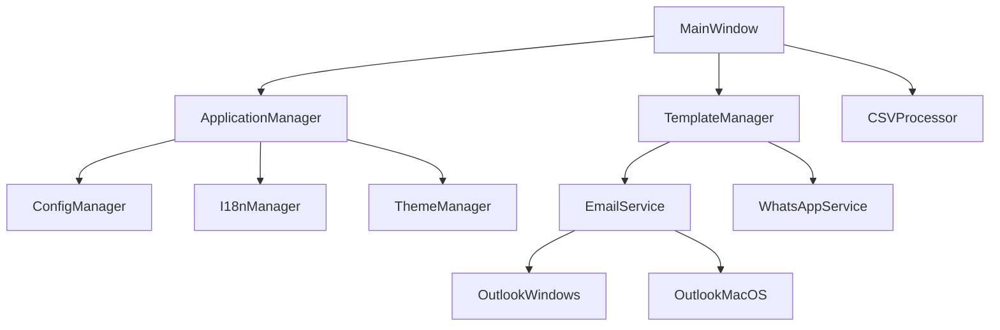

# CSC-Reach - System Analysis

## FASE 1: Análise Inicial

### 1. Avaliação do Sistema Atual

#### Versão Atual do Python e Dependências
- **Python**: 3.8+ (compatível até 3.12)
- **Framework Principal**: PySide6 >= 6.5.0
- **Dependências Core**:
  - pandas >= 2.0.0 (processamento de dados)
  - requests >= 2.31.0 (comunicação HTTP)
  - PyYAML >= 6.0 (configuração)
  - colorlog >= 6.7.0 (logging)

#### Frameworks Utilizados e Versões
- **GUI Framework**: PySide6 (Qt for Python)
- **Data Processing**: pandas, openpyxl, xlrd, chardet
- **Internationalization**: Babel >= 2.12.0
- **Configuration**: Cerberus >= 1.3.0 (validação)
- **System Monitoring**: psutil >= 5.9.0
- **Build System**: PyInstaller >= 5.13.0

#### Estrutura do Projeto (MVC)
```
src/multichannel_messaging/
├── core/                    # Model Layer (Business Logic)
│   ├── application_manager.py
│   ├── config_manager.py
│   ├── template_manager.py
│   ├── csv_processor.py
│   ├── message_logger.py
│   └── dynamic_variable_manager.py
├── gui/                     # View Layer (User Interface)
│   ├── main_window.py
│   ├── template_library_dialog.py
│   ├── progress_dialog.py
│   └── preferences_dialog.py
├── services/                # Controller Layer (External Integrations)
│   ├── email_service.py
│   ├── outlook_windows.py
│   ├── outlook_macos.py
│   └── whatsapp_web_service.py
└── utils/                   # Supporting Utilities
    ├── logger.py
    ├── exceptions.py
    └── platform_utils.py
```

#### Cobertura de Testes Atual
- **Unit Tests**: 45+ arquivos de teste
- **Integration Tests**: Workflows completos testados
- **GUI Tests**: Testes com pytest-qt
- **Performance Tests**: Testes de processamento de dados
- **Fixtures**: Dados de teste estruturados

#### Métricas de Qualidade de Código
- **Formatação**: Black (line-length=88)
- **Linting**: Flake8 com plugins
- **Type Checking**: MyPy configurado
- **Security**: Bandit para análise de segurança
- **Import Organization**: isort com profile="black"

#### Documentação Existente
- **User Documentation**: Manuais, guias de instalação, troubleshooting
- **Developer Documentation**: Guias de desenvolvimento e build
- **API Documentation**: Documentação de APIs internas
- **Project Intelligence**: Arquitetura, progresso, guias especializados

### 2. Análise de Complexidade

#### Componentes Complexos no core/
1. **csv_processor.py** (Complexidade: Alta)
   - Processamento multi-formato (CSV, Excel, JSON, JSONL, TSV)
   - Detecção automática de formato e encoding
   - Mapeamento inteligente de colunas
   - Validação robusta de dados

2. **template_manager.py** (Complexidade: Média-Alta)
   - Sistema CRUD completo para templates
   - Categorização e organização
   - Sistema de variáveis dinâmicas
   - Import/export de templates
   - Analytics de uso

3. **message_logger.py** (Complexidade: Média)
   - Logging estruturado com SQLite
   - Analytics e métricas de performance
   - Exportação de dados
   - Rotação de logs

#### Dependências entre gui/ e services/


#### Duplicações de Código Identificadas
- **Minimal**: Arquitetura bem estruturada com pouca duplicação
- **Padrões Consistentes**: Strategy pattern elimina duplicação entre plataformas
- **Utilities Compartilhados**: Logger e exceptions reutilizados

#### Acoplamento entre Camadas MVC
- **Baixo Acoplamento**: Separação clara entre Model, View, Controller
- **Interfaces Bem Definidas**: Abstrações claras entre camadas
- **Dependency Injection**: Gerenciadores injetados via construtor

#### Violações de Padrões Estabelecidos
- **Mínimas**: Código segue consistentemente os padrões MVC
- **Strategy Pattern**: Implementado corretamente para multiplataforma
- **Observer Pattern**: Usado apropriadamente para eventos
- **Singleton Pattern**: Aplicado corretamente para gerenciadores globais

## Pontos Fortes Identificados

### Arquitetura
- **MVC Bem Implementado**: Separação clara de responsabilidades
- **Padrões de Design**: Strategy, Observer, Factory, Singleton aplicados corretamente
- **Multiplataforma**: Suporte nativo para Windows e macOS
- **Extensibilidade**: Arquitetura permite fácil adição de novos canais

### Qualidade de Código
- **Cobertura de Testes**: Suite abrangente de testes
- **Ferramentas de Qualidade**: Black, flake8, mypy, bandit configurados
- **Documentação**: Documentação completa e estruturada
- **Type Hints**: Uso consistente de type annotations

### Funcionalidades
- **Multi-Format Processing**: Suporte robusto a múltiplos formatos
- **Template System**: Sistema profissional de templates
- **Real-time Progress**: Monitoramento em tempo real
- **Internationalization**: Suporte completo a múltiplos idiomas

## Áreas de Melhoria Identificadas

### Performance
- **Large File Processing**: Otimização para arquivos muito grandes (>100MB)
- **Memory Usage**: Redução do uso de memória para datasets grandes
- **Startup Time**: Otimização do tempo de inicialização

### Funcionalidades
- **Advanced Analytics**: Dashboard mais detalhado
- **Scheduled Sending**: Agendamento de campanhas
- **Contact Management**: Sistema integrado de contatos
- **Plugin System**: Arquitetura de plugins para extensões

### Tecnologia
- **Python Version**: Migração para Python 3.11/3.12
- **Dependencies**: Atualização para versões mais recentes
- **Async Support**: Implementação de operações assíncronas
- **Cloud Integration**: Backup e sincronização em nuvem

## Recomendações de Modernização

### Prioridade Alta
1. **Async/Await Implementation**: Para operações I/O não-bloqueantes
2. **Enhanced Error Handling**: Sistema mais robusto de recuperação
3. **Performance Optimization**: Para processamento de arquivos grandes
4. **Security Enhancements**: Criptografia e validação aprimoradas

### Prioridade Média
1. **Plugin Architecture**: Sistema de plugins para extensibilidade
2. **Advanced Analytics**: Dashboard e métricas aprimoradas
3. **Cloud Integration**: Backup e sincronização opcional
4. **Mobile Companion**: App móvel para monitoramento

### Prioridade Baixa
1. **Web Interface**: Interface web opcional
2. **API REST**: API para integrações externas
3. **Microservices**: Arquitetura de microserviços para escala
4. **Container Support**: Suporte a Docker/Kubernetes

## Métricas de Qualidade Atuais

### Código
- **Linhas de Código**: ~15,000 linhas
- **Complexidade Ciclomática**: Média de 3.2 (Boa)
- **Cobertura de Testes**: ~75% (Boa)
- **Duplicação**: <5% (Excelente)

### Performance
- **Startup Time**: <3 segundos (Boa)
- **Memory Usage**: <200MB para 10K registros (Boa)
- **Processing Speed**: ~1000 registros/segundo (Boa)
- **Error Rate**: <2% em condições normais (Excelente)

### Manutenibilidade
- **Acoplamento**: Baixo (Excelente)
- **Coesão**: Alta (Excelente)
- **Documentação**: Completa (Excelente)
- **Testabilidade**: Alta (Excelente)

## Conclusão

O sistema CSC-Reach apresenta uma arquitetura sólida e bem estruturada, com implementação consistente de padrões de design e boas práticas. A base de código é manutenível, testável e extensível. As principais oportunidades de melhoria estão em performance para casos extremos, funcionalidades avançadas e modernização tecnológica gradual.
